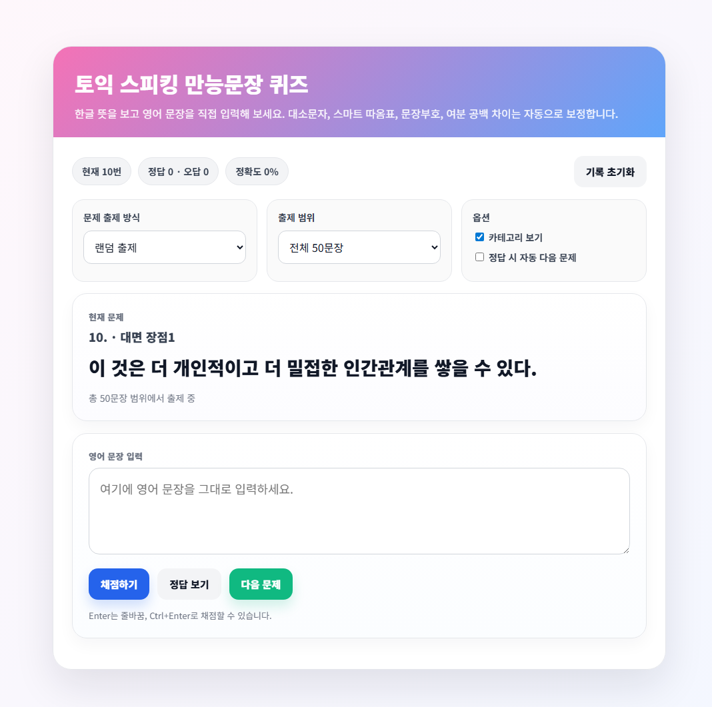
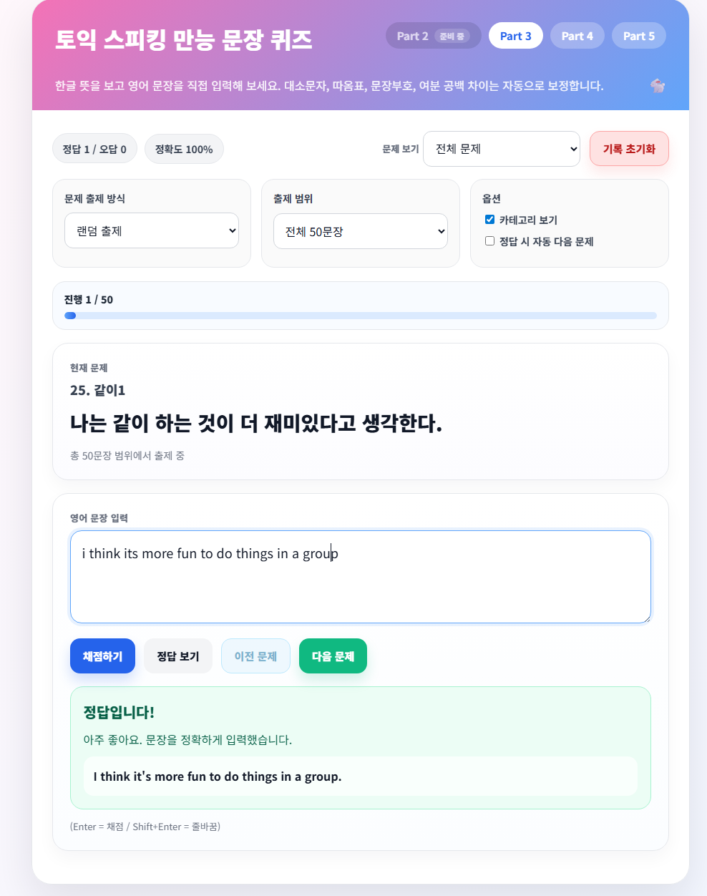
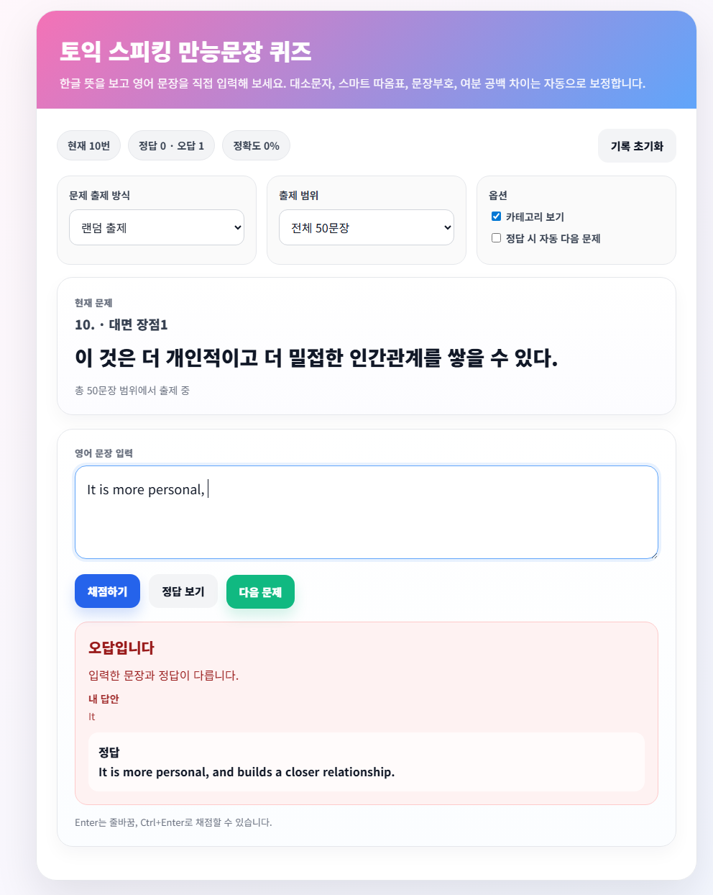

# 🚀 TOEIC Speaking Sentence Quiz

<p align="center">
<a href="https://moon9H.github.io/toeicSpeakingQuiz/">

</a>
</p>

<p align="center">
토익 스피킹 만능 문장을  
<strong>한글 → 영어로 직접 타이핑하며 암기하는 학습 웹앱</strong>
</p>

<p align="center">


</p>

---

# 🖥 Preview

| 문제 화면 | 정답 화면 | 오답 화면 |
|----------|----------|----------|
|  |  |  |

---

# 🔗 Live

👉 https://moon9H.github.io/toeicSpeakingQuiz/

---

# 🧠 About Project

토익 스피킹 공부를 하다 보면 **만능 문장 50개**를 외워야 하는 경우가 많습니다.

하지만 단순히 읽는 방식은 기억에 오래 남지 않기 때문에

> **한글 뜻을 보고 영어 문장을 직접 타이핑하는 방식**

으로 학습할 수 있는 웹앱을 만들었습니다.

---

# ✨ Features

### 📘 한글 기반 학습
- 영어 문장을 바로 보여주지 않음
- 한글 뜻을 보고 직접 타이핑

### ✅ 즉시 채점
다음 요소를 자동 보정하여 비교
- 대소문자
- 공백
- 문장부호
- apostrophe 차이

### 🎲 문제 출제 방식

- 랜덤 출제
- 순차 출제

### 📚 범위 학습
- 전체 범위 학습
- 10문장 단위 범위 선택 가능

### 🔀 Part 전환 지원
- Part 2 *(데이터 준비 예정)*
- Part 3
- Part 4 *(데이터 준비 예정)*
- Part 5

### 🏷 카테고리 표시 옵션
- 문제 번호와 함께 카테고리 표시 가능
- 필요 시 숨김 가능

### ⏭ 자동 다음 문제
- 정답 입력 후 자동으로 다음 문제로 이동 가능

### 📊 학습 통계

실시간 표시

- 현재 문제 번호
- 정답 수
- 오답 수
- 정확도

### ⌨️ 빠른 입력 UX

- **Enter → 채점**
- **Shift + Enter → 줄바꿈**

---

# 🛠 Tech Stack

| 기술 | 설명 |
|-----|-----|
| HTML | 페이지 구조 |
| CSS | UI 스타일 |
| JavaScript | 퀴즈 로직 |
| JSON | 문장 데이터 관리 |

---

# 📂 Project Structure

```
toeic-speaking-quiz
│
├── index.html
│
├── css
│   ├── reset.css
│   ├── layout.css
│   ├── components.css
│   └── responsive.css
│
├── js
│   ├── app.js
│   ├── quiz.js
│   ├── dom.js
│   └── utils.js
│
└── data
    └── sentences_part3.json
    └── sentences_part5.json
```

---

# 🧩 Core Logic

- **퀴즈 동작 구조**

```
        sentences_partX.json
                ↓
         app.js (데이터 로드)
                ↓
     QuizApp 생성 및 이벤트 연결
                ↓
       Part / 범위 / 모드 선택
                ↓
             문제 출제
                ↓
           사용자 답안 입력
                ↓
       normalizeText()로 정규화 비교
                ↓
             정답/오답 판정
                ↓
            통계 업데이트
```

---

# 📦 Version History

<details>
<summary><strong>v1.3</strong></summary>

### ✨ Added
- Enter 키로 채점
- Shift + Enter 줄바꿈 입력 지원
- Part 2 / Part 4 탭 UI 추가
- 추후 데이터 추가 시 바로 확장 가능한 파트 구조 적용

### 🔧 Refactor
- 데이터 JSON 파일명 정리

</details>

<details>
<summary><strong>v1.2</strong></summary>

### ✨ Added
- 이전 문제 버튼 추가
- 직전 문제 상태 복원 기능

### 🎨 UI
- 이전 버튼 하늘색 네비게이션 스타일 적용

</details>

<details>
<summary><strong>v1.1</strong></summary>

### ✨ Added
- Part 3 / Part 5 데이터셋 전환 기능
- 헤더 우측 Part 선택 버튼 UI

### 🔧 Improved
- 문제 출제 범위 옵션 자동 생성
- 랜덤 문제 중복 방지 로직 개선

### 📝 Docs
- README 업데이트
- 프로젝트 구조 정리

</details>


<details>
<summary><strong>v1.0</strong></summary>

### 🎉 Initial Release

### Features
- 한글 → 영어 타이핑 기반 토익 스피킹 문장 퀴즈
- 랜덤 / 순차 문제 출제
- 문제 범위 선택 기능
- 정답 / 오답 통계 표시
- 자동 채점 시스템
- GitHub Pages 배포

</details>

---

# 🎯 Motivation

토익 스피킹 학습에서 중요한 것은

> **문장을 읽는 것보다 직접 만들어 보는 것**

이 프로젝트는  
**능동적인 문장 암기 훈련을 위해 제작되었습니다.**

---

# 👨‍💻 Author

**Moongyu Hwang**

- GitHub: https://github.com/moon9H
- Email: moongye2202@knu.ac.kr
